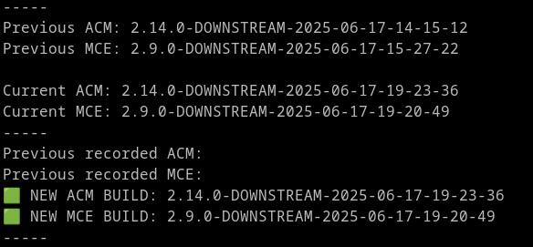
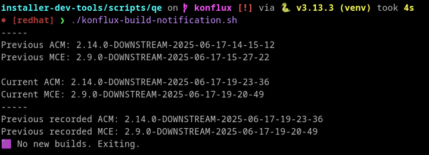

# Konflux Build Notification Script

## Log into quay.io
```bash
podman login -u='<user>' -p='<quay token>' quay.io
```

## Run konflux-build-notification.sh
```bash
./konflux-build-notification.sh
```

The first time you run this, you will get an output stating that a new build has been released. This is because `latest-acm.txt` and `latest-mce.txt` haven't been created yet. Subsequent runs will only produce this output if there's actually a new build.




## Script output and artifacts
When the script finishes, you should see diff sections. These should be included when posting to the forums. There are also files `./diff-acm.txt` and `./diff-mce.txt` which contain the same contents.

When posting the updates, please include the contents of these files.

### Additional files
There are also a bunch of files in `./tmp`. The ones ending in `-bundles.yaml`, `-repos.txt` and `-summary.txt` are generated and used in the script (and future scripts)


## Roadmap
This script should be converted to Python, but then it will be fairly straightforward to make this check PR build statuses in the way that the previous CPaaS checker worked (which is now broken due to CPaaS no longer being built)